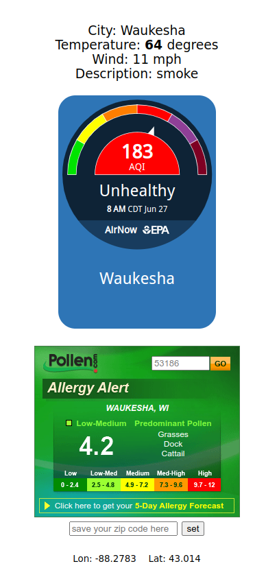

# Air
Weather and Air Quality information Demo

Demonstrates the use of three different API with JavaScript
in a web page, and session Management with a cookie.

All information is keyed on zip code.
Does NOT use browser's location API.

## API providers
https://openweathermap.org/api  
https://www.pollen.com/tools/partners  
https://www.airnow.gov/aqi-widgets/  

